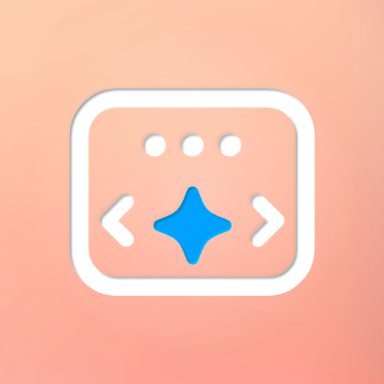

# 🚀 CodaWarm (with AI CodOt) — Personal AI Coding Assistant



**CodaWarm (CodOt)** adalah asisten pemrograman berbasis AI yang dirancang untuk mempercepat proses coding tanpa mengorbankan kendali kreatif developer. Aplikasi ini ditenagai oleh **Gemini 3 Flash API**, dengan fokus pada kecepatan eksekusi, efisiensi konteks, dan privasi pengguna.

Proyek ini dibangun dengan prinsip yang tegas: **AI adalah alat, bukan pengambil keputusan**. Seluruh ide, arsitektur sistem, alur fitur, dan arah pengembangan berasal dari kendali penuh manusia. AI digunakan secara strategis sebagai akselerator—mulai dari eksplorasi solusi teknis, asistensi debugging, hingga validasi logika—namun keputusan akhir tetap berada di tangan pengembang.

CodaWarm berjalan **sepenuhnya di sisi klien (client-side)**. Tidak ada server perantara, tidak ada penyimpanan tersembunyi. API Key dan data pengguna sepenuhnya berada di bawah kontrol pemiliknya.

---

## ✨ Fitur Unggulan

- **⚡ Gemini 3 Flash Integration**  
  Respon cepat untuk debugging, pembuatan fungsi, dan penjelasan logika kode secara kontekstual.

- **🧠 Intelligent State Management**  
  Menggunakan *state summarization* berbasis JSON untuk menjaga konteks percakapan tetap presisi tanpa pemborosan token.

- **🛡️ Privacy First**  
  API Key dan riwayat percakapan disimpan di `localStorage`. Tidak ada data yang dikirim ke pihak ketiga selain ke Google Gemini API.

- **📂 Artifact Downloads**  
  Potongan kode dapat diunduh langsung sebagai file fisik dengan ekstensi yang sesuai, hanya dengan satu klik.

- **🎨 Premium UI/UX**  
  Antarmuka modern berbasis *Glassmorphism*, dilengkapi **Loading Motion Screen** berdurasi 11 detik sebagai pembuka yang elegan.

- **📱 PWA Ready**  
  Mendukung instalasi di Android dan iOS melalui *Add to Home Screen*, lengkap dengan manifest dan meta tag mobile.

---

## 🛠️ Struktur Proyek (Minimalis & Sehat)

```text
codawarm-codot/
├── assets/
│   ├── img/            # Favicon, Apple Touch Icon, & OG Image          
│   └── logo-motion.mp4 # Logo Motion (intro)
├── index.html          # Entry point aplikasi
├── script.js           # Logika AI & State Management
├── style.css           # UI Glassmorphism & Animasi
├── site.webmanifest    # Konfigurasi PWA
├── .gitignore          # File yang diabaikan Git
└── README.md           # Dokumentasi proyek
```

---

## 🚀 Cara Memulai

### 1. Persiapan  
Pastikan memiliki **Gemini API Key**. API Key dapat diperoleh melalui Google AI Studio.

### 2. Instalasi Lokal

Clone repositori:
```bash
git clone https://github.com/dazep01/codawarm.git
```

Masuk ke direktori proyek:
```bash
cd codawarm-codot
```

Jalankan aplikasi:  
Buka `index.html` langsung di browser, atau gunakan **Live Server (VS Code)** untuk pengalaman pengembangan yang lebih nyaman.

### 3. Setup Aplikasi

- Buka aplikasi
- Nikmati loading motion logo CodaWarm
- Masukkan API Key melalui panel pengaturan (ikon user)
- Mulai coding bersama CodOt

---

## 📱 Penggunaan di Mobile (Android & iOS)

CodaWarm mendukung mode **Standalone (PWA)**.

- **Android**:  
  Buka melalui Chrome → menu titik tiga → *Install App*

- **iOS**:  
  Buka melalui Safari → *Share* → *Add to Home Screen*

---

## 🤝 Kontribusi

Kontribusi sangat terbuka dan dihargai.  
Jika memiliki ide untuk peningkatan *state management*, performa AI, atau UI/UX:

1. Fork repositori  
2. Buat branch fitur (`git checkout -b fitur/FiturKeren`)  
3. Commit perubahan (`git commit -m "Menambah Fitur Keren"`)  
4. Push ke branch (`git push origin fitur/FiturKeren`)  
5. Ajukan Pull Request  

---

## 📄 Lisensi

Proyek ini menggunakan **MIT License**.  
Lihat file `LICENSE` untuk detail lengkap.

---

**CodaWarm — Powered by Gemini AI**  
Built with intention, precision, and respect for human creativity.

_"Ketika ide manusia yang solid dipadukan dengan kecepatan eksekusi AI, hasilnya bukan sekadar cepat—tapi terarah."_
